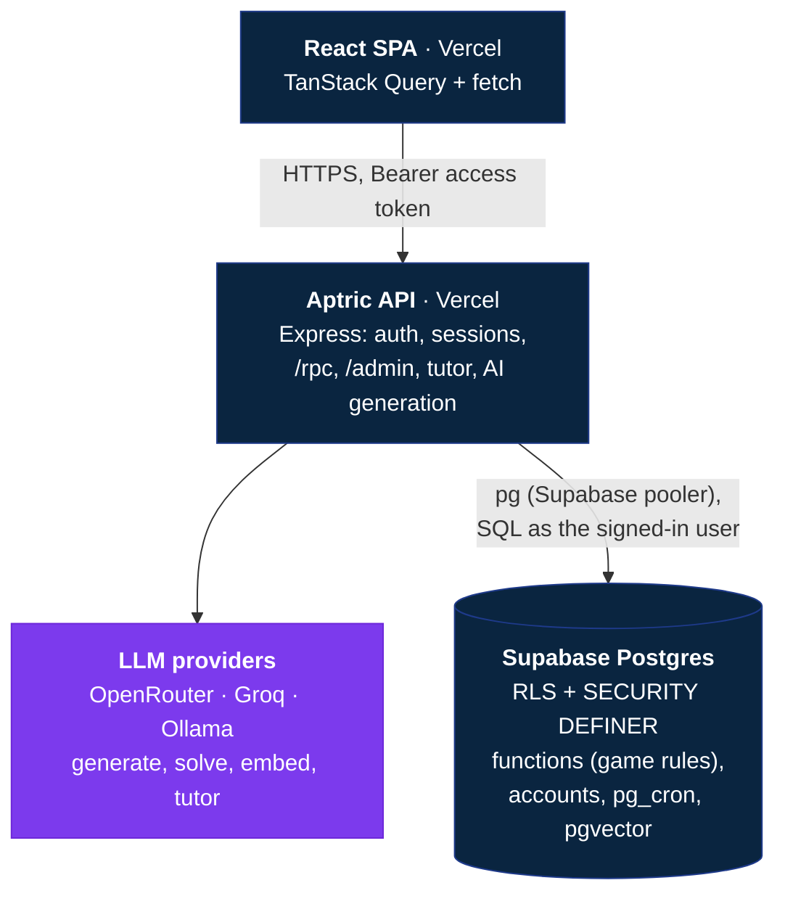

<div align="center">


<br>

**A daily aptitude platform for thinkers, builders and problem solvers.**<br>
Short daily challenges, focused practice and friendly leagues for placements, CAT, banking and more,<br>
on a question bank grown with verified AI generation.

<br>


<br>


<br><br>

[**Features**](#-features) · [**Tech stack**](#-tech-stack) · [**Architecture**](#-architecture) · [**Getting started**](#-getting-started) · [**Tests**](#-tests-and-checks) · [**Deployment**](#-deployment)

</div>


> **Planning docs:** [Security & bug audit](docs/SECURITY-AUDIT.md) · [Scaling plan](docs/SCALING.md) · [Roadmap, monetisation & competitive defence](docs/ROADMAP.md)

## 📖 Overview

Aptric is a **React + TypeScript** single-page app with a **Node.js (Express) API**, deployable to Vercel, on a **Supabase Postgres** database (Supabase is used only as the database).

- The **API** owns sign-in (email + password, email links, Google), sessions, the AI tutor and AI question generation.
- **Every game rule** (grading, hints, XP, streaks, levels, ratings, leagues, placement, contests) lives in Postgres as RLS policies and `SECURITY DEFINER` functions that the API runs as the signed-in user.
- So the browser **never sees an answer key** before it has spent its one scoring attempt.

<table>
<tr>
<td width="33%" valign="top">

### ① Pick your goal
Choose your exam and a daily target, then take a 10-question placement test that sets your starting level.

</td>
<td width="33%" valign="top">

### ② Solve your daily set
A new set lands every day at local midnight. Ask the tutor if you're stuck and read the explanation after every answer.

</td>
<td width="33%" valign="top">

### ③ Climb your league
Earn XP, keep your streak and move up each week, from Bronze all the way to Diamond.

</td>
</tr>
</table>


## ✨ Features

### For learners

<table>
<tr>
<td width="50%" valign="top">

#### 🔥 Today
A daily set per player, built from your level, league and topic preferences and released at local midnight, with streak, daily goal ring, level and league position.

</td>
<td width="50%" valign="top">

#### 🎯 Solve
One question at a time, timer, keyboard shortcuts (`1`–`4`, `Enter`, `H` for the tutor), "Give up & see answer" and a collapsible official explanation.

</td>
</tr>
<tr>
<td valign="top">

#### 📚 Practice
Section → topic → subtopic with mastery stars, search, preferred difficulty and a weak-areas mode.

</td>
<td valign="top">

#### ⚔️ Compete
Weekly leagues (Bronze → Diamond, standings refresh every 20 s), weekly / all-time / rating leaderboards and live contests. With [Community](#-community--safety) on, follow friends and filter boards and contest standings to them.

</td>
</tr>
<tr>
<td valign="top">

#### 📈 Progress
Skill radar, activity heatmap, recent daily sets and a mistakes-to-review list.

</td>
<td valign="top">

#### 👤 Profile
Public profile at `/u/:handle`, badges and share card. Time zone, daily-challenge topics, theme (light / dark / device) and reduced motion are on `/settings`.

</td>
</tr>
<tr>
<td valign="top">

#### 🧭 Onboarding
Pick a username, exam goal and daily target, then a 10-question placement test sets your starting level.

</td>
<td valign="top">

#### 🔐 Sign-in
Email + password, magic link and Google sign-in, all handled by the API.

</td>
</tr>
</table>

### 🤖 Aptric Tutor

An AI chat drawer for daily and practice sets (never in contests or placement). Open it from the floating chatbot icon on the solve screen (also **Hint**, **Ask Tutor** or `H`) and from the "Ask Tutor" button on every reviewed question (Progress → Mistakes, the session summary).

| Quick actions | |
| --- | --- |
| 💡 Hint · 🧭 Understand the question · 🪜 Solving steps · ➡️ Next step | 📘 Concept · 🎯 My training plan · 📖 Full explanation · free questions |

- Runs on **free open-source models** (OpenRouter `:free`, Groq or a local Ollama).
- **Grounded** in the verified answer key in Postgres.
- **Never gives the final answer** while you are still solving: prompt rules plus a server-side leak guard.
- Charges the hint penalty **once** through `use_hint`, and needs "Give up" before the full explanation.
- Only talks about Aptric and aptitude prep. Without a configured model it falls back to the stored hint and explanation.

### 🛡️ For admins

- Review queue for AI-generated questions, question search and editor, status changes (`draft` → `in review` → `published` → `retired`)
- Contests: list with state (draft / upcoming / live / ended) and participants, create/edit with start, end, duration and questions (from the bank or auto-picked by topic and difficulty), publish/unpublish, delete (only while nobody has joined) and standings with submissions
- User management (roles, bans), reports and feedback moderation, generation jobs and an audit log
- Every write is audited in Postgres by triggers or the `admin_*` RPCs

### 🗂️ The question bank

Five sections, every topic that matters, with easy / medium / hard difficulty, Markdown and KaTeX math.

| Section | Topics |
| --- | --- |
| 🧮 **Quantitative Aptitude** | Arithmetic · Algebra · Time, Work & Distance · Geometry & Mensuration · Counting & Probability |
| 🧩 **Logical Reasoning** | Arrangements & Puzzles · Deductive Reasoning · Clocks & Calendars · Non-Verbal Reasoning |
| 📝 **Verbal Ability** | Reading · Grammar & Usage · Vocabulary |
| 📊 **Data Interpretation** | Charts · Tables & Caselets · Mixed Graphs |
| 💻 **Technical Aptitude** | Output Prediction · OOP · DBMS · Operating Systems · Computer Networks |

Questions carry exam tags: `tcs-nqt` `infosys` `amcat` `cat` `gate` `bank-po` `ssc`.

> [!NOTE]
> AI-generated questions go through the API's generation pipeline (`backend/src/generation`). Each one is **schema-validated**, **de-duplicated** by hash and embedding similarity, **arithmetic-checked** where the options are numeric, and **independently solved by a second model** before it reaches the review queue. Nothing is published without an admin's approval.


## 🛠 Tech stack

| Layer | Technologies |
| --- | --- |
| **Frontend** | React 19, TypeScript, Vite, TanStack Query, React Router 7, Tailwind CSS v4, Radix UI, KaTeX, Marked |
| **Backend** | Node.js 22, Express 5, `pg`, bcrypt, JWT, Nodemailer (SMTP), Google OAuth |
| **Database** | Supabase Postgres 17 (RLS, SQL functions, pg_cron, pgvector, pg_trgm) |
| **AI** | OpenRouter (or any OpenAI-compatible API) for generation, verification and embeddings; OpenRouter `:free`, Groq or Ollama for the tutor |
| **Tests** | Vitest + Testing Library (frontend), Playwright (e2e), `node --test` (backend), pgTAP (`supabase test db`) |
| **Hosting** | Vercel (frontend and API), Supabase (database) |

**Brand:** deep navy `#0A2540` for trust, electric blue `#2563EB` for action, violet `#7C3AED` for energy and achievement, Light Blue `#38BDF8` for interaction on dark surfaces, blue → violet gradients, Plus Jakarta Sans throughout. Every text/background pair meets WCAG AA in both themes, checked by `frontend/src/test/contrast.test.ts`.


## 📂 Repository structure

```text
.
├── frontend/                 # web app (React + TypeScript), deployed to Vercel
│   ├── src/
│   │   ├── pages/            # Landing, Today, Solve, Practice, Compete, Progress, Profile, Onboarding, …
│   │   ├── admin/            # admin area
│   │   ├── components/       # UI, layout, brand, charts, markdown, solve, compete
│   │   ├── context/          # session, preferences, toasts, auth dialog
│   │   └── lib/              # API client + session (http.ts), auth.ts, typed wrappers (api.ts), queries
│   └── .env.example
│
├── backend/                  # API (Node.js + Express), deployed to Vercel
│   ├── api/index.js          # Vercel entry
│   ├── src/                  # routes (auth, rpc, me, admin), auth, db, tutor, AI generation
│   ├── test/                 # node --test
│   ├── vercel.json
│   ├── .env.example
│   └── README.md             # setup, deploy, auth flows, API reference
│
├── supabase/                 # database only
│   ├── migrations/           # schema, RLS, SQL functions, cron jobs, seeds (applied in order)
│   ├── tests/database/       # pgTAP tests
│   ├── types/                # generated database.types.ts
│   └── README.md             # schema, access model, functions, jobs
│
├── prompts/                  # build prompts: brand spec, redesign, tutor, question bank, review
│
└── README.md
```


## 🏗 Architecture



Scheduled jobs (pg_cron, UTC): daily set generation, hourly streak settlement with streak freezes, weekly league rollover, rating updates, leaderboard refreshes and expired-session cleanup. See [supabase/README.md](supabase/README.md#scheduled-jobs-pg_cron).


## 📋 Prerequisites

- Node.js 22+ and npm
- A Supabase project (or Docker for the local stack)
- Supabase CLI (`npx supabase`)
- A Gmail / Google Workspace account with an app password, for sign-up / sign-in emails over Google SMTP (optional locally)
- A Google OAuth client (only for Google sign-in)
- An OpenRouter API key (only for AI question generation and the tutor)

## ⚙ Getting started

<details open>
<summary><b>1. Clone</b></summary>

```bash
git clone https://github.com/Rakesh-Bhandari/Aptric.git
cd Aptric
```

</details>

<details open>
<summary><b>2. Database</b></summary>

Local stack:

```bash
npx supabase start            # needs Docker
npx supabase db reset         # applies supabase/migrations + seed.sql
```

Hosted project:

```bash
npx supabase link --project-ref <project-ref>
npx supabase db push          # applies any migrations the project doesn't have yet
```

> [!IMPORTANT]
> `20261002000001_backend_auth.sql` moves accounts off Supabase Auth: existing users are copied into `private.accounts` with their passwords. Afterwards turn off sign-ups in Supabase Auth; keep the Data API enabled, since the API reaches `public.backend_sql` through it (see [backend/README.md](backend/README.md#lock-down-the-supabase-project)).

</details>

<details open>
<summary><b>3. API (backend)</b></summary>

```bash
cd backend
cp .env.example .env          # SUPABASE_URL, SUPABASE_SECRET_KEY, JWT_SECRET, FRONTEND_URL, API_URL, SMTP_*, GOOGLE_* ...
npm install
npm run dev                   # http://localhost:5000
```

For the local stack use `SUPABASE_URL=http://127.0.0.1:54321` and the "Secret key" from `npx supabase status`. Without SMTP settings the sign-up / sign-in links are printed in this terminal. AI generation needs `OPEN_ROUTER_API_KEY` (see [backend/.env.example](backend/.env.example)).

</details>

<details open>
<summary><b>4. Frontend</b></summary>

```bash
cd frontend
cp .env.example .env.local    # set VITE_API_URL=http://localhost:5000
npm install
npm run dev                   # http://localhost:6969
```

The frontend only knows the API's URL; no keys or database credentials go there.

</details>

<details open>
<summary><b>5. Make yourself an admin</b></summary>

After signing up, run this in the SQL editor:

```sql
update public.profiles set role = 'admin' where handle = '<your-handle>';
```

</details>


## 🤝 Community & safety

Aptric's social layer exists to keep learners accountable to each other, not to be a social network: everything is tied to practice, and it ships dark (`plans.features.community_follow`, see `backend/README.md`) so it can open for a pilot college first.

- **Follow, don't friend-request.** Following is one-way; friends are people who follow each other. Private accounts approve followers, and a declined request is silent. Lists of a private account are for its followers only.
- **Privacy defaults.** A profile shows handle, avatar, level, league, streak and rating. Accuracy is for followers, the exam target and college are for nobody, and your name appears in search and lists only if you allow it (Settings → Privacy and friends). You can leave search and the activity feed.
- **Search finds handles only**: never an email address or a real name, 30 searches a minute, and players who opted out are not listed.
- **Activity is facts, not text.** The friends feed only shows things that happened ("finished today's set (9/10)", "reached Gold league", "7-day streak") for 14 days; nobody can write into it.
- **Blocking** removes follows both ways and hides each of you from the other everywhere (search, lists, leaderboards, league, standings); a blocked player cannot tell they were blocked. **Reporting** a person files a report that only admins can read (never shown to the reported player); the admin queue for them arrives with the posts slice.
- **The 48-hour rule.** Community posts are short, about practice (a question, a tip, a win, a study buddy, a poll), and **disappear exactly 48 hours after they are written**: they are invisible the second they expire, then deleted within 15 minutes. They cannot be edited or extended, and you can delete yours at any time. Posts are **public** to every signed-in player while they live; nothing private belongs in one, and the composer says so. No IP addresses are stored with posts.
- **Spoilers.** A post about a question shows only its wording. If it looks like it gives away the answer, the author has to mark it as a spoiler, and the server hides a spoiler from anyone who has not attempted that question. Posts about a question in a running contest are not allowed.
- **Moderation.** Anyone can report a post (spam, abuse, answer leak, personal info, other). Three different reporters hide it until a moderator reviews it in **Admin → Community posts** (hide, restore, remove, dismiss; every action is in the audit log). Banned phrases and links (verified emails only) are filtered when posting. Reports against a deleted post leave a minimal snapshot (author, a hash of the text, reasons) for 30 days so repeat offenders can still be actioned; after three removals in 30 days a player's new posts wait for review, and after two their daily limit halves. Players can mute or block anyone.
- **Challenges, private leagues and hosted contests** arrive in the next slices of this feature; their rules are in the same section when they ship.

## 🧪 Tests and checks

```bash
# frontend
cd frontend && npm run lint && npm run typecheck && npm test
cd frontend && npm run e2e        # Playwright: axe, 360px layout, reduced motion, layout shift (mocked API)

# API
cd backend && npm test

# database (local stack running)
npx supabase test db
```

After changing the schema, regenerate the types:

```bash
npx supabase gen types typescript --local --schema public > supabase/types/database.types.ts
```

## 🌐 Deployment

| Part | How |
| --- | --- |
| **Database** | `npx supabase db push` to the linked project. The pg_cron schedules are created by the migrations. |
| **API** | A Vercel project with Root Directory `backend/` (`backend/vercel.json`) and the variables from `backend/.env.example` (`SUPABASE_URL` = the project URL, `SUPABASE_SECRET_KEY` = the project's secret key). Details in [backend/README.md](backend/README.md#deploy-to-vercel). |
| **Frontend** | A Vercel project with Root Directory `frontend/` (`frontend/vercel.json`) and `VITE_API_URL` set to the API's URL. |

## 📚 Further reading

- [backend/README.md](backend/README.md): API setup, Vercel deploy, auth flows, routes
- [supabase/README.md](supabase/README.md): access model, accounts, taxonomy, gameplay functions, progression, leagues, learner app, admin area, AI generation, scheduled jobs
- [frontend/README.md](frontend/README.md): screens, conventions, theming and accessibility
- [prompts/frontend-redesign/BRAND.md](prompts/frontend-redesign/BRAND.md): logo, colour palette, buttons and accessibility rules

<br>

<div align="center">


<br><br>

⭐ **If you found this project useful, consider giving it a star!**

</div>
